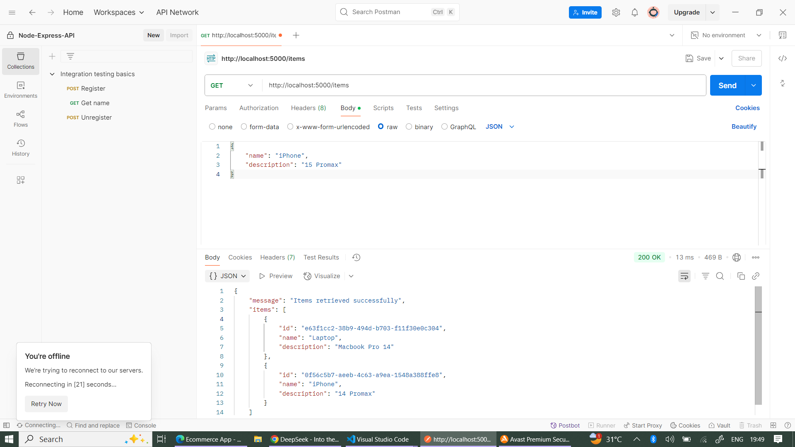
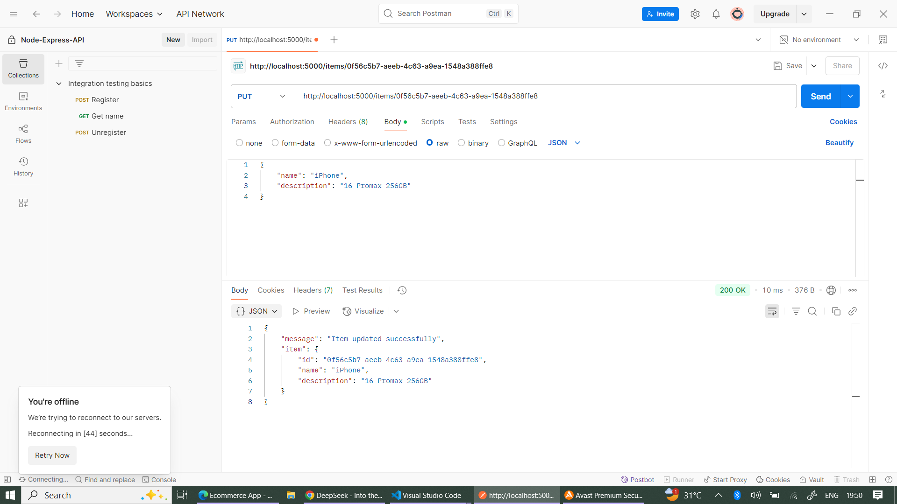
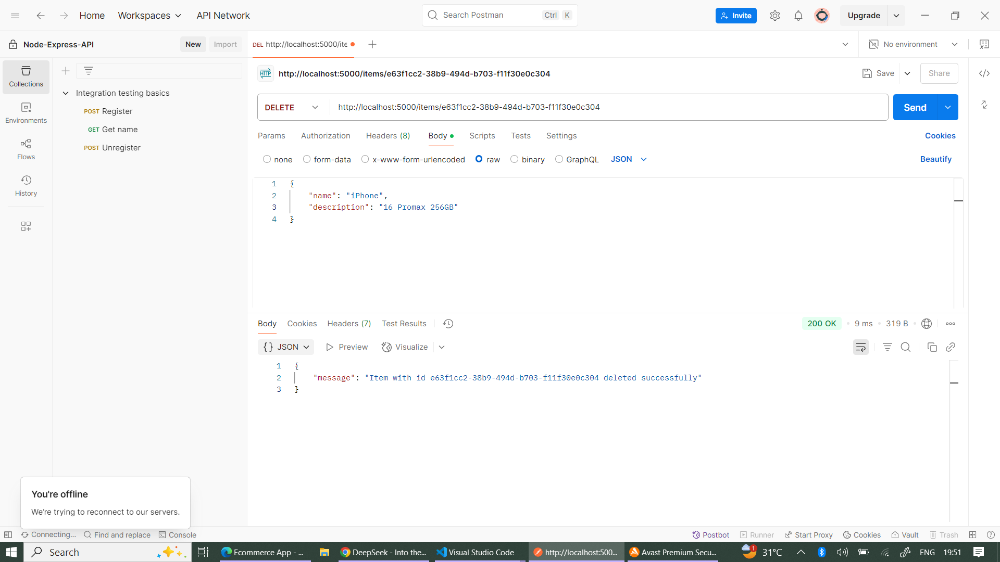

# Items API

## Table of Contents

- [Project Overview](#project-overview)  
- [Setup Instructions](#setup-instructions)  
- [API Documentation](#api-documentation)  
- [Request/Response Examples](#requestresponse-examples)  
- [Technologies Used](#technologies-used)

---

## Project Overview

This is a simple RESTful API for managing items with basic CRUD operations. The API allows you to:

- Create new items  
- Retrieve all items or a specific item by ID  
- Update existing items  
- Delete items  

The application uses an in-memory array for data storage (no database) and is built with Node.js and Express.

---

## Setup Instructions

### Prerequisites

- Node.js (v14 or higher)  
- npm or yarn

### Installation

Clone the repository:

```bash
git clone <repository-url>
cd <project-folder>
```

Install dependencies:

```bash
npm install
```

Start the server:

```bash
nodemon index.js
```

The server will start on port 5000 by default. You can access it at:

```
http://localhost:5000
```

---

## API Documentation

### Base URL

```
http://localhost:5000/items
```

### Endpoints

#### 1. Get All Items

- **URL**: /
- **Method**: GET
- **Response**: Returns all items in the system
- **Success**: 200 OK (Returns items or empty array)

#### 2. Create a New Item

- **URL**: /
- **Method**: POST
- **Body Parameters**:
  - `name` (string, required): Name of the item
  - `description` (string, required): Description of the item
- **Success**: 201 Created
- **Errors**: 400 Bad Request if required fields are missing

#### 3. Get a Specific Item

- **URL**: /:id
- **Method**: GET
- **URL Parameters**: id (string, UUID of the item)
- **Success**: 200 OK
- **Errors**: 404 Not Found if item doesn't exist

#### 4. Delete an Item

- **URL**: /:id
- **Method**: DELETE
- **URL Parameters**: id (string, UUID of the item)
- **Success**: 200 OK
- **Errors**: 404 Not Found if item doesn't exist

#### 5. Update an Item (Full Update)

- **URL**: /:id
- **Method**: PUT
- **URL Parameters**: id (string, UUID of the item)
- **Body Parameters**:
  - `name` (string, required)
  - `description` (string, required)
- **Success**: 200 OK
- **Errors**: 400 Bad Request if fields are missing, 404 Not Found if item doesn't exist

---

## Request/Response Examples

### 1. Create Item

**Request**:

```
POST /items
Content-Type: application/json
```

```json
{
  "name": "Laptop",
  "description": "MacBook Pro 14"
}
```

**Response on screenshot**:


### 2. Get All Items

**Request**:

```
GET /items
```

**Response on screenshot**:




### 3. Get Single Item

**Request**:

```
GET /items/a1b2c3d4-e5f6-7890-g1h2-i3j4k5l6m7n8
```

**Response on screenshot**:



### 4. Update Item

**Request**:

```
PUT /items/a1b2c3d4-e5f6-7890-g1h2-i3j4k5l6m7n8
Content-Type: application/json
```

**Response on screenshot**:


### 5. Delete Item

**Request**:

```
DELETE /items/a1b2c3d4-e5f6-7890-g1h2-i3j4k5l6m7n8
```

**Response on screenshot**:



---

## Technologies Used

- Node.js  
- Express.js  
- UUID (for generating unique IDs)  
- Postman (for API testing)

---